# 🚀 AWS VPC Lattice with TLS Demo

> A comprehensive demonstration of AWS VPC Lattice with TLS encryption for secure service-to-service communication using Python FastAPI applications.

## 📁 Project Structure

```
📦 vpc-lattice-demo/
├── 🏗️ IaC/
│   └── main.tf                 # Terraform infrastructure code
├── 🐍 PyApp1/
│   ├── main.py                 # Service A FastAPI application
│   ├── Dockerfile              # Container definition for Service A
│   ├── requirements.txt        # Python dependencies
│   └── .dockerignore          # Docker ignore file
└── 🐍 PyApp2/
    ├── main.py                 # Service B FastAPI application  
    ├── Dockerfile              # Container definition for Service B
    ├── requirements.txt        # Python dependencies
    └── .dockerignore          # Docker ignore file
```

---

## 🏗️ Architecture Overview

### 1. VPC Lattice Service Network

```mermaid
graph TB
    subgraph VPC["🌐 AWS VPC (ap-south-1)"]
        subgraph Public["📡 Public Subnets"]
            Bastion[🖥️ Bastion Host<br/>SSH Access]
            NAT[🌉 NAT Gateway<br/>with EIP]
        end
        
        subgraph Private["🔒 Private Subnets"]
            ECS_A[🐳 ECS Fargate<br/>Service A:8081]
            ECS_B[🐳 ECS Fargate<br/>Service B:8082]
        end
        
        subgraph Lattice["🔷 VPC Lattice Service Network"]
            SVC_A[🎯 Lattice Service A<br/>service-a.fast-api.local:443]
            SVC_B[🎯 Lattice Service B<br/>service-b.fast-api.local:443]
            
            TG_A[📊 Target Group A<br/>IP:8081]
            TG_B[📊 Target Group B<br/>IP:8082]
        end
        
        subgraph CA["🔐 AWS Private CA"]
            PCA[📜 Root CA<br/>VPC Lattice Private CA]
            CERT_A[🎫 ACM Certificate<br/>service-a.fast-api.local]
            CERT_B[🎫 ACM Certificate<br/>service-b.fast-api.local]
        end
        
        ECS_A -->|Register IP| TG_A
        ECS_B -->|Register IP| TG_B
        
        TG_A -->|Health Check<br/>/service-a/status| ECS_A
        TG_B -->|Health Check<br/>/service-b/status| ECS_B
        
        SVC_A -->|HTTPS:443| TG_A
        SVC_B -->|HTTPS:443| TG_B
        
        PCA -->|Issues| CERT_A
        PCA -->|Issues| CERT_B
        
        CERT_A -->|TLS| SVC_A
        CERT_B -->|TLS| SVC_B
        
        ECS_A -.->|HTTPS Call<br/>service-b.fast-api.local:443| SVC_B
        ECS_B -.->|HTTPS Call<br/>service-a.fast-api.local:443| SVC_A
    end
```


### 2. Service-to-Service Communication Flow

```mermaid
sequenceDiagram
    participant AppA as 🐍 Service A<br/>(Port 8081)
    participant LatticeA as 🔷 VPC Lattice<br/>Service A
    participant LatticeB as 🔷 VPC Lattice<br/>Service B
    participant AppB as 🐍 Service B<br/>(Port 8082)

    Note over AppA,AppB: Service A calls Service B
    
    AppA->>LatticeB: HTTPS GET<br/>https://service-b.fast-api.local/service-b/status
    Note over LatticeB: TLS Termination<br/>(ACM Certificate)
    LatticeB->>AppB: HTTP GET<br/>localhost:8082/service-b/status
    
    AppB->>LatticeB: HTTP Response<br/>{status: "healthy"}
    Note over LatticeB: TLS Encryption
    LatticeB->>AppA: HTTPS Response<br/>{status: "healthy"}
    
    Note over AppA,AppB: Service B calls Service A
    
    AppB->>LatticeA: HTTPS GET<br/>https://service-a.fast-api.local/service-a/status
    Note over LatticeA: TLS Termination<br/>(ACM Certificate)
    LatticeA->>AppA: HTTP GET<br/>localhost:8081/service-a/status
    
    AppA->>LatticeA: HTTP Response<br/>{status: "healthy"}
    Note over LatticeA: TLS Encryption
    LatticeA->>AppB: HTTPS Response<br/>{status: "healthy"}
```


### 3. Complete Network Architecture
```
┌─────────────────────────────────────────────────────────────────────────────────┐
│                         🌐 AWS VPC (Default - ap-south-1)                        │
│                                                                                   │
│  ┌────────────────────────────┐         ┌──────────────────────────────┐        │
│  │   📡 Public Subnets         │         │   🔒 Private Subnets          │        │
│  │                             │         │                               │        │
│  │  ┌──────────────────────┐  │         │  ┌────────────────────────┐  │        │
│  │  │ 🖥️  Bastion Host      │  │         │  │ 🐳 ECS Fargate Tasks   │  │        │
│  │  │ t3.micro             │  │         │  │                        │  │        │
│  │  │ SSH: 0.0.0.0/0       │  │         │  │ Service A (8081)       │  │        │
│  │  │ ap-south-1a          │◄─┼─────────┼──│ Service B (8082)       │  │        │
│  │  └──────────────────────┘  │         │  │                        │  │        │
│  │                             │         │  │ No Public IP           │  │        │
│  │  ┌──────────────────────┐  │         │  │ ap-south-1a, 1b        │  │        │
│  │  │ 🌉 NAT Gateway        │  │         │  └────────────────────────┘  │        │
│  │  │ Elastic IP           │◄─┼─────────┼──────── Internet Access ─────  │        │
│  │  │ ap-south-1a          │  │         │                               │        │
│  │  └──────────────────────┘  │         └──────────────────────────────┘        │
│  └────────────────────────────┘                                                  │
│                                                                                   │
│  ┌─────────────────────────────────────────────────────────────────────────┐    │
│  │                   🔷 VPC Lattice Service Network                         │    │
│  │                     "fast-api-service-network"                           │    │
│  │                                                                           │    │
│  │  ┌───────────────────────────────────┐  ┌───────────────────────────┐  │    │
│  │  │  🎯 VPC Lattice Service A         │  │  🎯 VPC Lattice Service B  │  │    │
│  │  │                                   │  │                           │  │    │
│  │  │  Custom Domain:                   │  │  Custom Domain:           │  │    │
│  │  │  service-a.fast-api.local        │  │  service-b.fast-api.local │  │    │
│  │  │                                   │  │                           │  │    │
│  │  │  🎫 ACM Certificate               │  │  🎫 ACM Certificate        │  │    │
│  │  │  (Private CA Issued)              │  │  (Private CA Issued)      │  │    │
│  │  │                                   │  │                           │  │    │
│  │  │  📡 HTTPS Listener (443)          │  │  📡 HTTPS Listener (443)  │  │    │
│  │  │    └─► 📊 Target Group (IP)      │  │    └─► 📊 Target Group    │  │    │
│  │  │        Port: 8081                 │  │        Port: 8082         │  │    │
│  │  │        Protocol: HTTP             │  │        Protocol: HTTP     │  │    │
│  │  │        Health: /service-a/status  │  │        Health: /service-b │  │    │
│  │  │                                   │  │                  /status   │  │    │
│  │  └───────────────────────────────────┘  └───────────────────────────┘  │    │
│  │                          ▲                         ▲                     │    │
│  │                          │                         │                     │    │
│  │                          └─────── TLS ─────────────┘                     │    │
│  │                         Encrypted Communication                          │    │
│  └─────────────────────────────────────────────────────────────────────────┘    │
│                                                                                   │
│  ┌─────────────────────────────────────────────────────────────────────────┐    │
│  │              🔐 AWS Private Certificate Authority (PCA)                  │    │
│  │                                                                           │    │
│  │  📜 Root CA: "VPC Lattice Private CA"                                    │    │
│  │      Algorithm: RSA_2048, SHA256WITHRSA                                  │    │
│  │      Validity: 10 years                                                  │    │
│  │                                                                           │    │
│  │  🎫 Issued Certificates:                                                 │    │
│  │      ├─ service-a.fast-api.local                                         │    │
│  │      └─ service-b.fast-api.local                                         │    │
│  └─────────────────────────────────────────────────────────────────────────┘    │
└─────────────────────────────────────────────────────────────────────────────────┘
```

---

## 🔷 What is AWS VPC Lattice?

**AWS VPC Lattice** is a fully managed application networking service that consistently connects, monitors, and secures communications between your services, regardless of whether they are running on instances, containers, or serverless functions.

### 🌟 Key Features

| Feature | Description | Benefit |
|---------|-------------|---------|
| 🎯 **Service Discovery** | Automatic DNS-based service resolution | No manual service registry management |
| 🔐 **Built-in TLS** | Integrated certificate management | Encrypted service-to-service communication |
| 🌐 **Multi-VPC Support** | Connect services across VPCs and accounts | Simplified microservices architecture |
| 📊 **Observability** | Built-in metrics and logging | Monitor service health and performance |
| ⚖️ **Traffic Management** | Intelligent routing and load balancing | No need for traditional load balancers |
| 🛡️ **Security Policies** | Fine-grained access controls | Zero-trust service networking |

---

## 🔐 How VPC Lattice TLS Works

### 🎯 Service Communication Architecture

```
┌─────────────┐    HTTPS     ┌─────────────┐    HTTP      ┌─────────────┐
│   PyApp1    │ ────────────►│ VPC Lattice │ ────────────►│   PyApp2    │
│             │              │  Service B  │              │             │
│ Sends HTTPS │              │             │              │ Receives    │
│ Request to  │              │ TLS         │              │ HTTP        │
│ service-b   │              │ Termination │              │ Request     │
│ :443        │              │             │              │ on :8082    │
└─────────────┘              └─────────────┘              └─────────────┘
     │                             │                             │
     │                             ▼                             │
     │                    🎫 ACM Certificate                     │
     │                    (Issued by Private CA)                 │
     │                                                            │
     └────────────────── service-b.fast-api.local ──────────────┘
```

### 🔑 TLS Configuration Details

**Frontend (Client → Lattice):**
- Protocol: HTTPS on port 443
- TLS termination at VPC Lattice listener
- Uses ACM Private Certificates
- Custom domain names (e.g., `service-a.fast-api.local`)

**Backend (Lattice → ECS Tasks):**
- Protocol: HTTP on application ports (8081, 8082)
- Communication within AWS network (secure by design)
- No additional TLS overhead for backend
- Direct IP-based target registration

### 🏗️ VPC Lattice vs Traditional Load Balancers

| Feature | VPC Lattice | ALB/NLB |
|---------|-------------|---------|
| 🎯 **Service Discovery** | Built-in DNS | Requires external service registry |
| 🔐 **TLS Management** | Integrated with ACM | Manual certificate management |
| 🌐 **Multi-VPC** | Native support | Complex VPC peering required |
| 💰 **Cost** | Pay per service | Pay per load balancer instance |
| ⚙️ **Configuration** | Service-centric | Infrastructure-centric |
| 📊 **Observability** | Built-in metrics | CloudWatch integration required |

---

## 🔧 VPC Lattice Resources Explained

### 1️⃣ Service Network

**Resource:** `aws_vpclattice_service_network`

```hcl
resource "aws_vpclattice_service_network" "main" {
  name      = "fast-api-service-network"
  auth_type = "NONE"
}
```

**Purpose:**
- Creates a logical network for service-to-service communication
- Acts as a container for all your services
- Provides a boundary for access control and monitoring
- Enables cross-VPC and cross-account service connectivity

**VPC Association:**
```hcl
resource "aws_vpclattice_service_network_vpc_association" "main" {
  vpc_identifier             = data.aws_vpc.default_vpc.id
  service_network_identifier = aws_vpclattice_service_network.main.id
  security_group_ids         = [aws_security_group.vpc_lattice_sg.id]
}
```

This connects your VPC to the Lattice service network, allowing resources in the VPC to communicate with services registered in the network.

### 2️⃣ VPC Lattice Services

**Resources:** `aws_vpclattice_service.service_a` and `aws_vpclattice_service.service_b`

```hcl
resource "aws_vpclattice_service" "service_a" {
  name               = "fast-api-service-a"
  auth_type          = "NONE"
  custom_domain_name = "service-a.fast-api.local"
  certificate_arn    = aws_acm_certificate.service_a.arn
}
```

**Key Components:**
- **Name**: Identifier for the service within Lattice
- **Custom Domain**: Friendly DNS name for service discovery
- **Certificate ARN**: ACM certificate for TLS termination
- **Auth Type**: Authentication mechanism (NONE, AWS_IAM, or custom)

**DNS Entry:**
- VPC Lattice automatically creates DNS entries
- Format: `<service-name>-<random-id>.vpc-lattice-svcs.amazonaws.com`
- Custom domain alias: `service-a.fast-api.local`

### 3️⃣ Target Groups

**Resources:** `aws_vpclattice_target_group.service_a` and `aws_vpclattice_target_group.service_b`

```hcl
resource "aws_vpclattice_target_group" "service_a" {
  name = "fast-api-service-a-tg"
  type = "IP"
  
  config {
    port             = 8081
    protocol         = "HTTP"
    vpc_identifier   = data.aws_vpc.default_vpc.id
    protocol_version = "HTTP1"
    
    health_check {
      enabled                       = true
      path                          = "/service-a/status"
      protocol                      = "HTTP"
      port                          = 8081
      healthy_threshold_count       = 2
      unhealthy_threshold_count     = 2
      health_check_interval_seconds = 30
      health_check_timeout_seconds  = 5
    }
  }
}
```

**Target Group Types:**
- **IP**: Targets are registered by IP address (ideal for Fargate)
- **Instance**: Targets are EC2 instances
- **ALB**: Targets are Application Load Balancers
- **Lambda**: Targets are Lambda functions

**Health Check Configuration:**
- Monitors endpoint health every 30 seconds
- 2 consecutive successes → healthy
- 2 consecutive failures → unhealthy
- 5-second timeout per check
- Requests must return 200 OK status

### 4️⃣ Listeners

**Resources:** `aws_vpclattice_listener.service_a_https` and `aws_vpclattice_listener.service_b_https`

```hcl
resource "aws_vpclattice_listener" "service_a_https" {
  name               = "service-a-https-listener"
  protocol           = "HTTPS"
  service_identifier = aws_vpclattice_service.service_a.id
  port               = 443
  
  default_action {
    forward {
      target_groups {
        target_group_identifier = aws_vpclattice_target_group.service_a.id
        weight                  = 100
      }
    }
  }
}
```

**Listener Capabilities:**
- Accepts incoming connections on specified port
- Terminates TLS using ACM certificates
- Routes traffic based on rules to target groups
- Supports weighted routing for blue-green deployments
- Enables path-based and header-based routing

### 5️⃣ Service Network Associations

**Resources:** `aws_vpclattice_service_network_service_association`

```hcl
resource "aws_vpclattice_service_network_service_association" "service_a" {
  service_identifier         = aws_vpclattice_service.service_a.id
  service_network_identifier = aws_vpclattice_service_network.main.id
}
```

**Purpose:**
- Registers individual services with the service network
- Enables service discovery within the network
- Allows services to communicate with each other
- Applies network-level security policies

---

## 🔐 AWS Private Certificate Authority (PCA)

### 📜 Root CA Configuration

```hcl
resource "aws_acmpca_certificate_authority" "lattice_pca" {
  type = "ROOT"
  
  certificate_authority_configuration {
    key_algorithm     = "RSA_2048"
    signing_algorithm = "SHA256WITHRSA"
    
    subject {
      common_name  = "VPC Lattice Private CA"
      organization = "FastAPI Organization"
    }
  }
  
  usage_mode                      = "GENERAL_PURPOSE"
  permanent_deletion_time_in_days = 7
}
```

**Certificate Authority Details:**
- **Type**: ROOT CA (top of the trust hierarchy)
- **Algorithm**: RSA 2048-bit keys with SHA-256 signing
- **Purpose**: Issues certificates for internal services only
- **Lifecycle**: 7-day grace period before permanent deletion

### 🎫 ACM Private Certificates

```hcl
resource "aws_acm_certificate" "service_a" {
  domain_name               = "service-a.fast-api.local"
  certificate_authority_arn = aws_acmpca_certificate_authority.lattice_pca.arn
}
```

**Certificate Issuance Flow:**

```
1. Root CA Created
   └─► Self-signed certificate generated
   
2. Root CA Activated
   └─► Certificate installed on CA
   
3. Service Certificates Requested
   ├─► service-a.fast-api.local
   └─► service-b.fast-api.local
   
4. Certificates Issued
   └─► Signed by Root CA
   
5. Certificates Attached
   └─► Associated with VPC Lattice services
```

**Security Benefits:**
- Certificates are only valid within your AWS account
- Automatic certificate renewal (managed by AWS)
- No external CA dependencies
- Complete control over certificate lifecycle
- Zero-cost certificate issuance (pay only for CA)

---

## 🔑 IAM Roles & Policies Deep Dive

### 1️⃣ ECS Infrastructure Role

**Purpose:** Enables ECS service to register/deregister tasks with VPC Lattice target groups

```hcl
resource "aws_iam_role" "ecs_infrastructure_role" {
  name               = "fast-api-ecs-infrastructure-role"
  assume_role_policy = data.aws_iam_policy_document.ecs_infrastructure_assume_role.json
}
```

**Trust Policy:**
```json
{
  "Version": "2012-10-17",
  "Statement": [{
    "Effect": "Allow",
    "Principal": {
      "Service": "ecs.amazonaws.com"
    },
    "Action": "sts:AssumeRole"
  }]
}
```

**Permissions Policy:**
```hcl
resource "aws_iam_role_policy" "ecs_infrastructure_vpc_lattice_policy" {
  name = "ecs-infrastructure-vpc-lattice-policy"
  role = aws_iam_role.ecs_infrastructure_role.id
  
  policy = jsonencode({
    Version = "2012-10-17"
    Statement = [
      {
        Sid    = "ManagedVpcLatticeTargetRegistration"
        Effect = "Allow"
        Action = [
          "vpc-lattice:RegisterTargets",
          "vpc-lattice:DeregisterTargets"
        ]
        Resource = "arn:aws:vpc-lattice:*:*:targetgroup/*"
      },
      {
        Sid    = "DescribeVpcLatticeTargetGroup"
        Effect = "Allow"
        Action = "vpc-lattice:GetTargetGroup"
        Resource = "arn:aws:vpc-lattice:*:*:targetgroup/*"
      },
      {
        Sid    = "ListVpcLatticeTargets"
        Effect = "Allow"
        Action = "vpc-lattice:ListTargets"
        Resource = "arn:aws:vpc-lattice:*:*:targetgroup/*"
      },
      {
        Sid    = "DescribeEc2Resources"
        Effect = "Allow"
        Action = [
          "ec2:DescribeSubnets",
          "ec2:DescribeVpcs",
          "ec2:DescribeInstances",
          "ec2:DescribeNetworkInterfaces"
        ]
        Resource = "*"
      }
    ]
  })
}
```

**Required Permissions Explained:**

| Permission | Why It's Needed |
|------------|-----------------|
| `vpc-lattice:RegisterTargets` | Register Fargate task IPs with target group when tasks start |
| `vpc-lattice:DeregisterTargets` | Remove task IPs from target group when tasks stop |
| `vpc-lattice:GetTargetGroup` | Retrieve target group configuration details |
| `vpc-lattice:ListTargets` | Check currently registered targets for health |
| `ec2:DescribeNetworkInterfaces` | **Critical for Fargate**: Discover ENI and IP addresses of tasks |
| `ec2:DescribeSubnets` | Validate subnet configuration for target registration |
| `ec2:DescribeVpcs` | Verify VPC settings for network configuration |

**Why `ec2:DescribeNetworkInterfaces` is Critical for Fargate:**

Fargate tasks don't have static IPs. When a task starts:
1. AWS allocates an ENI (Elastic Network Interface)
2. The ENI gets a private IP address
3. ECS must discover this IP to register it with Lattice
4. Without this permission, registration fails silently

### 2️⃣ ECS Task Execution Role

**Purpose:** Allows ECS to pull images and write logs on behalf of your tasks

```hcl
resource "aws_iam_role" "ecs_task_execution_role" {
  name               = "fast-api-ecs-task-execution-role"
  assume_role_policy = data.aws_iam_policy_document.ecs_assume_role.json
}

resource "aws_iam_role_policy_attachment" "ecs_task_execution_policy" {
  role       = aws_iam_role.ecs_task_execution_role.name
  policy_arn = "arn:aws:iam::aws:policy/service-role/AmazonECSTaskExecutionRolePolicy"
}
```

**Managed Policy Includes:**
- Pull container images from ECR
- Write logs to CloudWatch Logs
- Retrieve secrets from Secrets Manager (if configured)
- Access Systems Manager Parameter Store (if configured)

### 3️⃣ ECS Task Role

**Purpose:** Grants permissions to your application code running inside containers

```hcl
resource "aws_iam_role" "ecs_task_role" {
  name               = "fast-api-ecs-task-role"
  assume_role_policy = data.aws_iam_policy_document.ecs_assume_role.json
}

resource "aws_iam_role_policy_attachment" "ecs_task_s3_policy" {
  role       = aws_iam_role.ecs_task_role.name
  policy_arn = "arn:aws:iam::aws:policy/AmazonS3FullAccess"
}

resource "aws_iam_role_policy_attachment" "ecs_task_secrets_policy" {
  role       = aws_iam_role.ecs_task_role.name
  policy_arn = "arn:aws:iam::aws:policy/SecretsManagerReadWrite"
}
```

**Current Permissions:**
- Full S3 access (read/write objects and buckets)
- Secrets Manager read/write access
- Can be extended with custom policies for other AWS services

---

## 🛡️ Security Groups Configuration

### 1️⃣ ECS Security Group

```hcl
resource "aws_security_group" "ecs_sg" {
  name_prefix = "ecs-sg-"
  vpc_id      = data.aws_vpc.default_vpc.id
  
  # Critical: Allow from VPC Lattice managed prefix list
  ingress {
    from_port       = 0
    to_port         = 0
    protocol        = "-1"
    prefix_list_ids = [data.aws_ec2_managed_prefix_list.vpc_lattice.id]
    description     = "Allow all traffic from VPC Lattice"
  }
  
  # Optional: Allow from Bastion for debugging
  ingress {
    from_port       = 0
    to_port         = 65535
    protocol        = "tcp"
    security_groups = [aws_security_group.bastion_sg.id]
    description     = "Allow all TCP traffic from Bastion"
  }
  
  egress {
    from_port   = 0
    to_port     = 0
    protocol    = "-1"
    cidr_blocks = ["0.0.0.0/0"]
    description = "Allow all outbound traffic"
  }
}
```

**VPC Lattice Managed Prefix List:**
- AWS maintains a prefix list of IP ranges used by VPC Lattice
- Format: `com.amazonaws.<region>.vpc-lattice`
- Automatically includes all IPs that Lattice uses for health checks and traffic
- **Critical**: Without this rule, health checks fail and targets remain unhealthy

### 2️⃣ VPC Lattice Security Group

```hcl
resource "aws_security_group" "vpc_lattice_sg" {
  name_prefix = "vpc-lattice-sg-"
  vpc_id      = data.aws_vpc.default_vpc.id
  
  egress {
    from_port       = 443
    to_port         = 443
    protocol        = "tcp"
    prefix_list_ids = [data.aws_ec2_managed_prefix_list.vpc_lattice.id]
    description     = "Allow outbound to VPC Lattice"
  }
  
  ingress {
    from_port   = 443
    to_port     = 443
    protocol    = "tcp"
    cidr_blocks = [data.aws_vpc.default_vpc.cidr_block]
    description = "Allow HTTPS from VPC"
  }
}
```

**Purpose:**
- Attached to VPC Lattice service network association
- Controls which resources can act as clients to Lattice services
- Enables resources in the VPC to make outbound HTTPS calls to Lattice

### 3️⃣ Bastion Security Group

```hcl
resource "aws_security_group" "bastion_sg" {
  name_prefix = "bastion-sg-"
  vpc_id      = data.aws_vpc.default_vpc.id
  
  ingress {
    from_port   = 22
    to_port     = 22
    protocol    = "tcp"
    cidr_blocks = ["0.0.0.0/0"]
    description = "Allow SSH from anywhere"
  }
  
  egress {
    from_port   = 0
    to_port     = 0
    protocol    = "-1"
    cidr_blocks = ["0.0.0.0/0"]
    description = "Allow all outbound traffic"
  }
}
```

---

## 🚀 Deployment Instructions

### ✅ Prerequisites

```bash
✓ AWS CLI configured with appropriate permissions
✓ Terraform >= 1.0 installed
✓ Docker installed and running
✓ ECR repositories access
✓ AWS credentials for ap-south-1 region
```

### 📋 Step-by-Step Deployment

#### 1️⃣ **Deploy Infrastructure**

```bash
cd IaC/
terraform init
terraform plan
terraform apply
```

**Expected Resources Created:**
- VPC networking (subnets, NAT gateway, route tables)
- Security groups
- ECS cluster
- ECR repositories
- VPC Lattice service network
- VPC Lattice services (Service A & B)
- Target groups and listeners
- AWS Private CA
- ACM certificates
- IAM roles and policies
- Bastion host

#### 2️⃣ **Build and Push Docker Images**

**Get ECR Login:**
```bash
aws ecr get-login-password --region ap-south-1 | \
docker login --username AWS --password-stdin \
<account-id>.dkr.ecr.ap-south-1.amazonaws.com
```

**Build and Push Service A:**
```bash
cd PyApp1/
docker build -t service-a .
docker tag service-a:latest \
  <account-id>.dkr.ecr.ap-south-1.amazonaws.com/fast-api-service-a-ecr:latest
docker push \
  <account-id>.dkr.ecr.ap-south-1.amazonaws.com/fast-api-service-a-ecr:latest
```

**Build and Push Service B:**
```bash
cd ../PyApp2/
docker build -t service-b .
docker tag service-b:latest \
  <account-id>.dkr.ecr.ap-south-1.amazonaws.com/fast-api-service-b-ecr:latest
docker push \
  <account-id>.dkr.ecr.ap-south-1.amazonaws.com/fast-api-service-b-ecr:latest
```

#### 3️⃣ **Force Update ECS Services**

After pushing new images, update the ECS services to pull the latest images:

```bash
aws ecs update-service \
  --cluster fast-api-vpc-lattice-cluster \
  --service fast-api-service-a \
  --force-new-deployment \
  --region ap-south-1

aws ecs update-service \
  --cluster fast-api-vpc-lattice-cluster \
  --service fast-api-service-b \
  --force-new-deployment \
  --region ap-south-1
```

#### 4️⃣ **Monitor Deployment**

```bash
# Check service status
aws ecs describe-services \
  --cluster fast-api-vpc-lattice-cluster \
  --services fast-api-service-a fast-api-service-b \
  --region ap-south-1

# Watch tasks starting
aws ecs list-tasks \
  --cluster fast-api-vpc-lattice-cluster \
  --region ap-south-1

# Check task details
aws ecs describe-tasks \
  --cluster fast-api-vpc-lattice-cluster \
  --tasks $(aws ecs list-tasks --cluster fast-api-vpc-lattice-cluster --query 'taskArns[0]' --output text --region ap-south-1) \
  --region ap-south-1
```

---

## 🧪 Testing the Application

### 🔍 **Get VPC Lattice Service Endpoints**

```bash
# Get Service A endpoint
SERVICE_A_ENDPOINT=$(terraform output -raw service_a_lattice_endpoint)
echo "Service A: $SERVICE_A_ENDPOINT"

# Get Service B endpoint
SERVICE_B_ENDPOINT=$(terraform output -raw service_b_lattice_endpoint)
echo "Service B: $SERVICE_B_ENDPOINT"
```

### 🖥️ **Connect to Bastion Host**

```bash
# Get bastion public IP
BASTION_IP=$(terraform output -raw bastion_public_ip)

# Connect using EC2 Instance Connect (recommended)
# Or use SSH with your key pair:
ssh -i your-key.pem ec2-user@$BASTION_IP
```

### 🎯 **Test Endpoints from Bastion**

Once connected to the bastion host, test the services:

| Endpoint | Purpose | Example Command |
|----------|---------|-----------------|
| 💚 **Health Check** | Service health status | `curl https://service-a.fast-api.local/service-a/status` |
| 📊 **Service Status** | Individual service info | `curl https://service-b.fast-api.local/service-b/status` |
| 🔄 **Inter-Service** | Service A → Service B | `curl https://service-a.fast-api.local/service-a/other-status` |
| 🔄 **Inter-Service** | Service B → Service A | `curl https://service-b.fast-api.local/service-b/other-status` |

**Complete Test Suite:**

```bash
# From bastion host

# Health checks
curl -k https://service-a.fast-api.local/service-a/status | jq
curl -k https://service-b.fast-api.local/service-b/status | jq

# Test inter-service communication
# Service A calling Service B
curl -k https://service-a.fast-api.local/service-a/other-status | jq

# Service B calling Service A  
curl -k https://service-b.fast-api.local/service-b/other-status | jq
```

**Note:** The `-k` flag is used because we're using private CA certificates. In production with proper certificate distribution, this flag wouldn't be needed.

### 📊 **Expected Response Format**

**Service Status Response:**
```json
{
  "service": "service-a",
  "status": "healthy",
  "timestamp": "2025-12-27T10:30:45.123456",
  "system_info": {
    "cpu_percent": 2.5,
    "memory_percent": 15.3,
    "process_id": 1
  }
}
```

**Inter-Service Call Response:**
```json
{
  "calling_service": "service-a",
  "called_service": "service-b",
  "called_endpoint": "https://service-b.fast-api.local/service-b/status",
  "response_from_other_service": {
    "service": "service-b",
    "status": "healthy",
    "timestamp": "2025-12-27T10:30:45.789012",
    "system_info": {
      "cpu_percent": 1.8,
      "memory_percent": 12.7,
      "process_id": 1
    }
  },
  "communication_successful": true
}
```

---

## 🐍 Python Application Details

### ⚙️ Service Configuration

| Service | Port | Calls To | Health Endpoint | Environment |
|---------|------|----------|-----------------|-------------|
| **Service A** | 8081 | Service B | `/service-a/status` | `SERVICE_B_URL` |
| **Service B** | 8082 | Service A | `/service-b/status` | `SERVICE_A_URL` |

### 🌍 Environment Variables

**Service A:**
```bash
SERVICE_NAME=service-a
SERVER_PORT=8081
SERVICE_B_LATTICE_ENDPOINT=https://service-b-<id>.vpc-lattice-svcs.amazonaws.com
SERVICE_B_URL=https://service-b.fast-api.local/service-b/status
```

**Service B:**
```bash
SERVICE_NAME=service-b
SERVER_PORT=8082
SERVICE_A_LATTICE_ENDPOINT=https://service-a-<id>.vpc-lattice-svcs.amazonaws.com
SERVICE_A_URL=https://service-a.fast-api.local/service-a/status
```

### 📦 Dependencies

```python
fastapi==0.104.1        # Modern web framework
uvicorn==0.24.0         # ASGI server
requests==2.31.0        # HTTP client for inter-service calls
psutil==5.9.6           # System monitoring and metrics
```

### 🔗 Key API Endpoints

**Service A Endpoints:**
```python
GET /service-a/status          # Health check and system metrics
GET /service-a/other-status    # Calls Service B via VPC Lattice
```

**Service B Endpoints:**
```python
GET /service-b/status          # Health check and system metrics
GET /service-b/other-status    # Calls Service A via VPC Lattice
```

### 📝 Sample Application Code

**main.py (Service A):**
```python
from fastapi import FastAPI
import requests
import psutil
import os
from datetime import datetime

app = FastAPI()

SERVICE_NAME = os.getenv("SERVICE_NAME", "service-a")
SERVER_PORT = int(os.getenv("SERVER_PORT", 8081))
SERVICE_B_URL = os.getenv("SERVICE_B_URL", "https://service-b.fast-api.local/service-b/status")

@app.get(f"/{SERVICE_NAME}/status")
async def get_status():
    return {
        "service": SERVICE_NAME,
        "status": "healthy",
        "timestamp": datetime.now().isoformat(),
        "system_info": {
            "cpu_percent": psutil.cpu_percent(),
            "memory_percent": psutil.virtual_memory().percent,
            "process_id": os.getpid()
        }
    }

@app.get(f"/{SERVICE_NAME}/other-status")
async def call_other_service():
    try:
        # Call Service B via VPC Lattice with TLS
        response = requests.get(SERVICE_B_URL, verify=False, timeout=5)
        response.raise_for_status()
        
        return {
            "calling_service": SERVICE_NAME,
            "called_service": "service-b",
            "called_endpoint": SERVICE_B_URL,
            "response_from_other_service": response.json(),
            "communication_successful": True
        }
    except Exception as e:
        return {
            "calling_service": SERVICE_NAME,
            "called_service": "service-b",
            "error": str(e),
            "communication_successful": False
        }

if __name__ == "__main__":
    import uvicorn
    uvicorn.run(app, host="0.0.0.0", port=SERVER_PORT)
```

---

## 🔒 Security Features

| Feature | Implementation | Benefit |
|---------|----------------|---------|
| 🛡️ **TLS Encryption** | VPC Lattice HTTPS listeners | All service-to-service traffic encrypted |
| 🔑 **Private CA** | AWS ACM Private CA | Internal certificate management |
| 🔐 **Certificate Automation** | ACM integration | Automatic issuance and renewal |
| 🏠 **Network Isolation** | Private subnets | No direct internet access for services |
| 🎯 **Security Groups** | VPC Lattice prefix lists | Precise traffic control |
| 👤 **IAM Controls** | Fine-grained policies | Least privilege access |
| 🚪 **Bastion Access** | Jump host pattern | Secure administrative access |
| 📊 **Target Health** | Health check monitoring | Automatic unhealthy target removal |

### 🔐 TLS Certificate Trust

**Important:** Services use private CA certificates. To avoid SSL warnings:

1. **For Testing (Bastion Host):**
   ```bash
   curl -k https://service-a.fast-api.local/service-a/status
   ```

2. **For Production:**
   - Distribute the Root CA certificate to all clients
   - Install in system trust store
   - Configure applications to trust the CA

3. **From Application Code:**
   ```python
   # Service-to-service calls should verify certificates
   # In this demo, we use verify=False for simplicity
   # In production, provide the CA certificate path:
   response = requests.get(url, verify='/path/to/ca-cert.pem')
   ```

---

## 📊 Monitoring & Troubleshooting

### 🔍 **VPC Lattice Monitoring**

```bash
# Check VPC Lattice service status
aws vpc-lattice list-services \
  --region ap-south-1

# Describe specific service
aws vpc-lattice get-service \
  --service-identifier <service-id> \
  --region ap-south-1

# List target group targets
aws vpc-lattice list-targets \
  --target-group-identifier <target-group-id> \
  --region ap-south-1

# Check target health
aws vpc-lattice get-target-group \
  --target-group-identifier <target-group-id> \
  --region ap-south-1
```

### 📝 **CloudWatch Logs**

```bash
# View ECS logs
aws logs tail /ecs/fast-api-vpc-lattice --follow --region ap-south-1

# Filter logs by service
aws logs tail /ecs/fast-api-vpc-lattice \
  --filter-pattern "service-a" \
  --follow \
  --region ap-south-1

# Get specific log stream
aws logs get-log-events \
  --log-group-name /ecs/fast-api-vpc-lattice \
  --log-stream-name service-a/service-a/$(date +%Y/%m/%d) \
  --region ap-south-1
```

### 🚨 **Common Issues & Solutions**

| Issue | Symptoms | Solution |
|-------|----------|----------|
| 🔍 **DNS Resolution** | `Could not resolve host` | Verify VPC Lattice service network association |
| 🔐 **Certificate Errors** | `SSL certificate verify failed` | Check Private CA is active and certificates issued |
| 💚 **Health Check Failures** | Targets remain unhealthy | Ensure ECS security group allows VPC Lattice prefix list |
| 🌐 **Connection Timeouts** | `Connection timed out` | Verify security groups and subnet routing |
| 🎯 **Target Registration** | No targets in target group | Check ECS infrastructure role IAM permissions |
| 📊 **503 Errors** | Service unavailable | Ensure at least one healthy target exists |

### 🔧 **Debug Checklist**

**1. Verify VPC Lattice Service Network:**
```bash
aws vpc-lattice list-service-network-vpc-associations \
  --service-network-identifier <service-network-id> \
  --region ap-south-1
```

**2. Check Target Group Health:**
```bash
aws vpc-lattice list-targets \
  --target-group-identifier <target-group-id> \
  --region ap-south-1
```

**3. Verify ECS Service Status:**
```bash
aws ecs describe-services \
  --cluster fast-api-vpc-lattice-cluster \
  --services fast-api-service-a \
  --region ap-south-1 \
  --query 'services[0].events[0:5]'
```

**4. Check Task Logs:**
```bash
# Get task ID
TASK_ID=$(aws ecs list-tasks \
  --cluster fast-api-vpc-lattice-cluster \
  --service-name fast-api-service-a \
  --region ap-south-1 \
  --query 'taskArns[0]' \
  --output text | cut -d'/' -f3)

# View logs
aws logs tail /ecs/fast-api-vpc-lattice \
  --log-stream-name-prefix "service-a/service-a/$TASK_ID" \
  --follow \
  --region ap-south-1
```

**5. Test from Bastion:**
```bash
# SSH to bastion
ssh ec2-user@<bastion-ip>

# Test DNS resolution
nslookup service-a.fast-api.local
nslookup service-b.fast-api.local

# Test connectivity
curl -k -v https://service-a.fast-api.local/service-a/status
```

### 📈 **Performance Monitoring**

```bash
# ECS service metrics
aws cloudwatch get-metric-statistics \
  --namespace AWS/ECS \
  --metric-name CPUUtilization \
  --dimensions Name=ServiceName,Value=fast-api-service-a Name=ClusterName,Value=fast-api-vpc-lattice-cluster \
  --start-time $(date -u -d '1 hour ago' +%Y-%m-%dT%H:%M:%S) \
  --end-time $(date -u +%Y-%m-%dT%H:%M:%S) \
  --period 300 \
  --statistics Average \
  --region ap-south-1

# VPC Lattice metrics
aws cloudwatch get-metric-statistics \
  --namespace AWS/VPCLattice \
  --metric-name ActiveConnectionCount \
  --dimensions Name=ServiceName,Value=fast-api-service-a \
  --start-time $(date -u -d '1 hour ago' +%Y-%m-%dT%H:%M:%S) \
  --end-time $(date -u +%Y-%m-%dT%H:%M:%S) \
  --period 300 \
  --statistics Sum \
  --region ap-south-1
```

---

## 🧹 Cleanup

### ⚠️ **Before Destroying Infrastructure**

1. Stop ECS services to deregister targets gracefully
2. Wait for target groups to show no healthy targets
3. Verify no active connections to VPC Lattice services

### 🗑️ **Destroy Resources**

```bash
cd IaC/
terraform destroy --auto-approve
```

### ✅ **Verify Cleanup**

```bash
# Check ECS clusters
aws ecs list-clusters \
  --region ap-south-1 \
  --query 'clusterArns[?contains(@, `fast-api`)]'

# Check VPC Lattice service networks
aws vpc-lattice list-service-networks \
  --region ap-south-1 \
  --query 'items[?name==`fast-api-service-network`]'

# Check ECR repositories
aws ecr describe-repositories \
  --region ap-south-1 \
  --query 'repositories[?contains(repositoryName, `fast-api`)]'

# Check Private CA
aws acm-pca list-certificate-authorities \
  --region ap-south-1 \
  --query 'CertificateAuthorities[?CertificateAuthorityConfiguration.Subject.CommonName==`VPC Lattice Private CA`]'
```

---

## 🎯 Key Takeaways

### ✅ **What This Demo Proves**

- ✨ **Simplified Networking**: No traditional load balancers required
- 🔐 **Built-in TLS**: Automatic certificate management with Private CA
- 🎯 **Service Discovery**: DNS-based service resolution
- 📊 **Health Monitoring**: Integrated health checks and target management
- 🚀 **Fargate Ready**: Seamless integration with serverless containers
- 🔄 **Bi-directional Communication**: Services can call each other securely

### 🏆 **VPC Lattice Advantages**

| Traditional Approach | VPC Lattice Approach |
|---------------------|---------------------|
| Separate ALB/NLB per service | Single service network |
| Manual service registry | Automatic service discovery |
| Complex certificate management | Integrated ACM Private CA |
| VPC peering for multi-VPC | Native multi-VPC support |
| Manual health check configuration | Built-in health monitoring |
| High infrastructure cost | Pay-per-use pricing |

### 🔮 **Production Considerations**

#### 🔒 **Security Enhancements**
- Enable AWS IAM authentication for VPC Lattice services
- Implement fine-grained access policies
- Distribute Root CA certificate to all clients
- Enable VPC Flow Logs for traffic analysis
- Use AWS WAF for additional protection

#### 📊 **Monitoring & Observability**
- Set up CloudWatch dashboards for VPC Lattice metrics
- Configure CloudWatch alarms for health check failures
- Enable X-Ray tracing for request tracking
- Implement structured logging with correlation IDs

#### 🏗️ **High Availability**
- Deploy across multiple availability zones
- Configure auto-scaling for ECS services
- Implement circuit breakers for fault tolerance
- Set up proper health check thresholds

#### 🔄 **CI/CD Integration**
- Automate Docker image builds
- Implement blue-green deployments
- Use Terraform workspaces for environments
- Set up automated testing pipelines

#### 📈 **Performance Optimization**
- Configure appropriate health check intervals
- Tune target group deregistration delay
- Implement connection pooling in applications
- Use caching strategies where appropriate

---

## 📚 Additional Resources

### 🔗 **AWS Documentation**
- [VPC Lattice User Guide](https://docs.aws.amazon.com/vpc-lattice/latest/ug/)
- [VPC Lattice API Reference](https://docs.aws.amazon.com/vpc-lattice/latest/APIReference/)
- [AWS Private CA Documentation](https://docs.aws.amazon.com/acm-pca/)
- [ECS Service Connect Guide](https://docs.aws.amazon.com/AmazonECS/latest/developerguide/service-connect.html)

### 🎓 **Learning Resources**
- AWS VPC Lattice Workshops
- FastAPI Documentation
- Terraform AWS Provider Documentation
- ECS Best Practices Guide

### 💡 **Related Patterns**
- Service Mesh with App Mesh
- API Gateway with Lambda
- ECS with Application Load Balancer
- Multi-Region Service Discovery

---

## 📋 Quick Reference

### 🔑 **Important Terraform Outputs**

```bash
terraform output bastion_public_ip
terraform output service_a_lattice_endpoint
terraform output service_b_lattice_endpoint
terraform output bastion_connection_info
```

### 📝 **Useful AWS CLI Commands**

```bash
# List all VPC Lattice services
aws vpc-lattice list-services --region ap-south-1

# Describe ECS cluster
aws ecs describe-clusters --clusters fast-api-vpc-lattice-cluster --region ap-south-1

# List running tasks
aws ecs list-tasks --cluster fast-api-vpc-lattice-cluster --region ap-south-1

# View CloudWatch logs
aws logs tail /ecs/fast-api-vpc-lattice --follow --region ap-south-1

# Check Private CA status
aws acm-pca describe-certificate-authority \
  --certificate-authority-arn <ca-arn> \
  --region ap-south-1
```

### 🐳 **Docker Commands**

```bash
# Build image
docker build -t service-a .

# Tag for ECR
docker tag service-a:latest <account>.dkr.ecr.ap-south-1.amazonaws.com/fast-api-service-a-ecr:latest

# Push to ECR
docker push <account>.dkr.ecr.ap-south-1.amazonaws.com/fast-api-service-a-ecr:latest

# ECR login
aws ecr get-login-password --region ap-south-1 | docker login --username AWS --password-stdin <account>.dkr.ecr.ap-south-1.amazonaws.com
```

---

*Built with ❤️ using AWS VPC Lattice, Terraform, and Python FastAPI*

**Region:** ap-south-1 (Mumbai)  
**Architecture:** ECS Fargate + VPC Lattice + Private CA  
**Communication:** HTTPS with TLS encryption