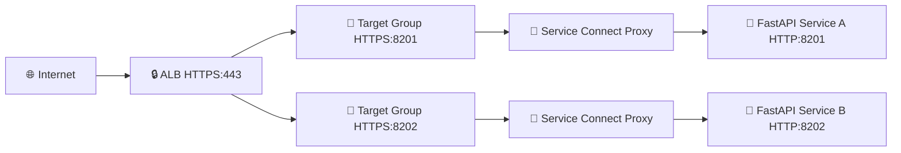
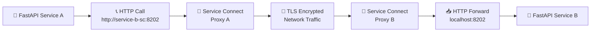
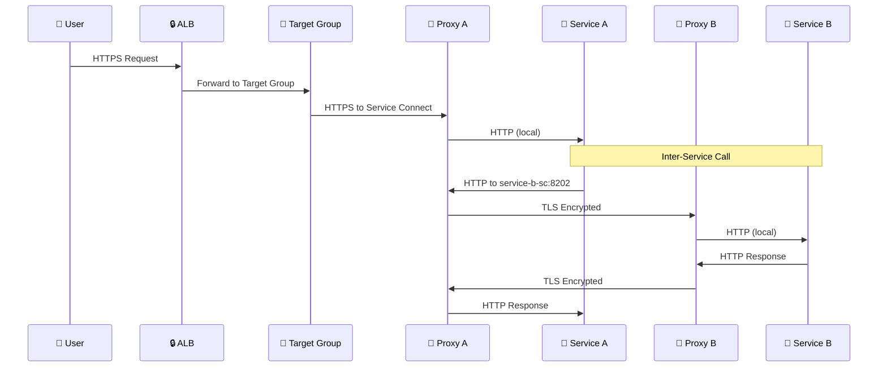

# 🚀 ECS Service Connect with TLS Demo

> A comprehensive demonstration of AWS ECS Service Connect with TLS encryption for secure service-to-service communication using Python FastAPI applications.

## 📁 Project Structure

```
📦 ecs-service-connect-demo/
├── 🏗️ IaC/
│   └── main.tf                 # Terraform infrastructure code
├── 🐍 PyApp1/
│   ├── main.py                 # Service A FastAPI application
│   ├── Dockerfile              # Container definition for Service A
│   ├── requirements.txt        # Python dependencies
│   └── .dockerignore          # Docker ignore file
└── 🐍 PyApp2/
    ├── main.py                 # Service B FastAPI application  
    ├── Dockerfile              # Container definition for Service B
    ├── requirements.txt        # Python dependencies
    └── .dockerignore          # Docker ignore file
```

---

## 🏗️ Architecture Overview

### 1. External Traffic Flow


### 2. Service-to-Service Communication


### 3. Complete Data Flow


---

## 🔐 How ECS Service Connect TLS Works

### 🎯 Service Discovery & Communication
- **Service Connect** provides DNS-based service discovery within the ECS cluster
- Services communicate using friendly DNS names: 
  - `service-a-sc` 
  - `service-b-sc`
- No hardcoded IP addresses or complex service registry management needed

### 🛡️ Multi-Layer Security Architecture

| Layer | Protocol | Description |
|-------|----------|-------------|
| 🌐 **External** | HTTPS:443 | Internet to ALB |
| 🎯 **ALB to Service** | HTTPS:8201/8202 | Load balancer to Service Connect |
| 🔧 **Proxy to Proxy** | TLS (mTLS) | Encrypted service-to-service |
| 🐍 **App to Proxy** | HTTP | Local container communication |

### 🔄 Encryption Flow Details

```
┌─────────────┐    HTTP     ┌─────────────┐    TLS      ┌─────────────┐    HTTP     ┌─────────────┐
│   PyApp1    │ ───────────▶│   Proxy A   │ ───────────▶│   Proxy B   │ ───────────▶│   PyApp2    │
│             │             │             │             │             │             │             │
│ Sends HTTP  │             │ Intercepts  │             │ Decrypts &  │             │ Receives    │
│ to service- │             │ & Encrypts  │             │ Forwards    │             │ HTTP        │
│ b-sc:8202   │             │ with TLS    │             │ HTTP        │             │ Request     │
└─────────────┘             └─────────────┘             └─────────────┘             └─────────────┘
```

### 🔑 Certificate Management
- **AWS Private CA**: Automatically issues and rotates certificates
- **mTLS**: Mutual TLS authentication between service proxies
- **Zero Configuration**: Applications require no certificate management
- **Short-lived Certificates**: Enhanced security with automatic rotation

---

## 🏗️ Infrastructure Components

### ☁️ AWS Resources Created

| Resource | Purpose | Configuration |
|----------|---------|---------------|
| 🌐 **VPC** | Network isolation | Default VPC with public/private subnets |
| 🚀 **ECS Cluster** | Container orchestration | Fargate with Service Connect enabled |
| 🔐 **Private CA** | Certificate authority | AWS ACM PCA for TLS certificates |
| ⚖️ **ALB** | Load balancing | Application Load Balancer for external traffic |
| 🎯 **Target Groups** | Health monitoring | Health-checked endpoints per service |
| 🗺️ **Service Discovery** | DNS resolution | Private DNS namespace |
| 🔑 **IAM Roles** | Permissions | Service Connect TLS operations |

### 🔧 Service Connect Configuration

```yaml
Namespace: fast-api-namespace
TLS: Enabled with AWS Private CA
Service Names:
  - service-a-sc (HTTP endpoint)
  - service-b-sc (HTTP endpoint)
Health Checks: /service-{a,b}/healthcheck
```

---

## 🚀 Deployment Instructions

### ✅ Prerequisites
```bash
✓ AWS CLI configured with appropriate permissions
✓ Terraform >= 1.0 installed
✓ Docker installed and running
✓ ECR repositories access
```

### 📋 Step-by-Step Deployment

#### 1️⃣ **Deploy Infrastructure**
```bash
cd IaC/
terraform init
terraform plan
terraform apply
```

#### 2️⃣ **Build and Push Applications**

**Get ECR Login:**
```bash
aws ecr get-login-password --region us-east-2 | \
docker login --username AWS --password-stdin \
<account-id>.dkr.ecr.us-east-2.amazonaws.com
```

**Build and Push Service A:**
```bash
cd PyApp1/
docker build -t service-a .
docker tag service-a:latest \
  <account-id>.dkr.ecr.us-east-2.amazonaws.com/fast-api-a-ecr-repository:latest
docker push \
  <account-id>.dkr.ecr.us-east-2.amazonaws.com/fast-api-a-ecr-repository:latest
```

**Build and Push Service B:**
```bash
cd ../PyApp2/
docker build -t service-b .
docker tag service-b:latest \
  <account-id>.dkr.ecr.us-east-2.amazonaws.com/fast-api-b-ecr-repository:latest
docker push \
  <account-id>.dkr.ecr.us-east-2.amazonaws.com/fast-api-b-ecr-repository:latest
```

#### 3️⃣ **Monitor Deployment**
```bash
# Check service status
aws ecs describe-services \
  --cluster fast-api-cluster \
  --services service-a service-b

# Watch tasks starting
aws ecs list-tasks --cluster fast-api-cluster
```

---

## 🧪 Testing the Application

### 🔍 **Get ALB DNS Name**
```bash
ALB_DNS=$(aws elbv2 describe-load-balancers \
  --names ecs-alb \
  --query 'LoadBalancers[0].DNSName' \
  --output text)
echo "ALB URL: https://$ALB_DNS"
```

### 🎯 **Test Endpoints**

| Endpoint | Purpose | Example |
|----------|---------|---------|
| 💚 **Health Checks** | ALB monitoring | `curl https://$ALB_DNS/service-a/healthcheck` |
| 📊 **Service Status** | Individual service info | `curl https://$ALB_DNS/service-a/status` |
| 🔄 **Inter-Service** | Service A → Service B | `curl https://$ALB_DNS/service-a/other-status` |

**Complete Test Suite:**
```bash
# Health checks
curl -s https://$ALB_DNS/service-a/healthcheck | jq
curl -s https://$ALB_DNS/service-b/healthcheck | jq

# Individual service status  
curl -s https://$ALB_DNS/service-a/status | jq
curl -s https://$ALB_DNS/service-b/status | jq

# Inter-service communication
curl -s https://$ALB_DNS/service-a/other-status | jq
curl -s https://$ALB_DNS/service-b/other-status | jq
```

---

## 🐍 Python Application Details

### ⚙️ Service Configuration

| Service | Port | Calls | Health Check |
|---------|------|-------|-------------|
| **Service A** | 8201 | `http://service-b-sc:8202` | `/service-a/healthcheck` |
| **Service B** | 8202 | `http://service-a-sc:8201` | `/service-b/healthcheck` |

### 🌍 Environment Variables
```bash
SERVICE_NAME=service-a                                    # Service identifier
SERVER_PORT=8201                                         # Internal HTTP port  
SERVICE_B_URL=http://service-b-sc:8202/service-b/status  # Other service endpoint
```

### 📦 Dependencies
```python
fastapi         # Modern web framework
uvicorn         # ASGI server
requests        # HTTP client for inter-service calls
psutil          # System monitoring and metrics
```

### 🔗 Key API Endpoints
```python
GET /service-a/healthcheck     # ALB health monitoring
GET /service-a/status          # Service metrics (CPU, memory)
GET /service-a/other-status    # Call other service via Service Connect
```

---

## 🔒 Security Features

| Feature | Implementation | Benefit |
|---------|----------------|---------|
| 🛡️ **Encryption in Transit** | TLS between all service proxies | Zero plaintext network traffic |
| 🔑 **Certificate Management** | AWS Private CA automation | No manual certificate handling |
| 🤝 **Zero Trust** | mTLS authentication | Service identity verification |
| 🏠 **Network Isolation** | Private subnets + NACLs | Restricted network access |
| 👤 **IAM Controls** | Fine-grained permissions | Principle of least privilege |
| 🔄 **Automatic Rotation** | Short-lived certificates | Reduced credential exposure |

---

## 📊 Monitoring & Troubleshooting

### 🔍 **Health Check Commands**
```bash
# Service Connect status
aws ecs describe-services \
  --cluster fast-api-cluster \
  --services service-a \
  --query 'services[0].serviceConnectConfiguration'

# Service Connect logs
aws logs describe-log-streams \
  --log-group-name /ecs/fast-api \
  --log-stream-name-prefix service-connect

# Application logs
aws logs get-log-events \
  --log-group-name /ecs/fast-api \
  --log-stream-name "service-a/service-a/$(date +%Y/%m/%d)"
```

### 🚨 **Common Issues & Solutions**

| Issue | Symptoms | Solution |
|-------|----------|----------|
| 🔍 **DNS Resolution** | `Name resolution failed` | Verify Service Connect namespace is active |
| 🔐 **Certificate Issues** | `TLS handshake failed` | Check Private CA status and IAM permissions |
| 💚 **Health Check Failures** | Targets showing unhealthy | Ensure apps respond on health endpoints |
| 🌐 **Network Connectivity** | Timeouts or connection refused | Verify security groups and subnet routing |

### 📈 **Performance Monitoring**
```bash
# CPU and Memory usage
aws ecs describe-services \
  --cluster fast-api-cluster \
  --services service-a service-b \
  --query 'services[*].{Name:serviceName,Running:runningCount,Desired:desiredCount}'

# Task health
aws ecs describe-tasks \
  --cluster fast-api-cluster \
  --tasks $(aws ecs list-tasks --cluster fast-api-cluster --query 'taskArns[]' --output text)
```

---

## 🧹 Cleanup

```bash
# Destroy all resources
cd IaC/
terraform destroy --auto-approve

# Verify cleanup
aws ecs list-clusters --query 'clusterArns[?contains(@, `fast-api`)]'
```

---

## 🎯 Key Takeaways

### ✅ **What This Demo Proves**
- ✨ **Zero Application Changes**: Standard HTTP code gets automatic TLS encryption
- 🔄 **Seamless Service Discovery**: No hardcoded IPs or service registries
- 🛡️ **Enterprise Security**: mTLS with AWS-managed certificates
- 🚀 **Production Ready**: Health checks, monitoring, and automated scaling

### 🔮 **Production Considerations**
- 📊 **Monitoring**: Add CloudWatch dashboards and alerts
- 🔄 **CI/CD**: Implement automated deployments
- 🏗️ **Multi-AZ**: Deploy across multiple availability zones
- 🔐 **Secrets**: Use AWS Secrets Manager for sensitive data
- 📈 **Scaling**: Configure auto-scaling policies

---

*Built with ❤️ using AWS ECS Service Connect, Terraform, and Python FastAPI*